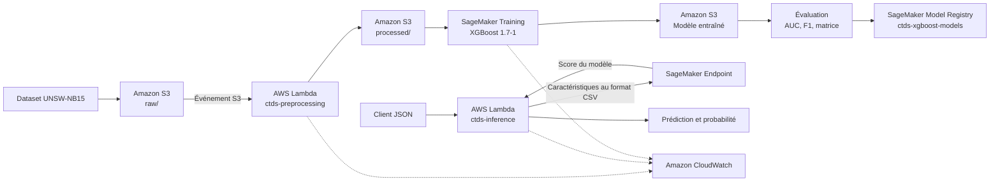
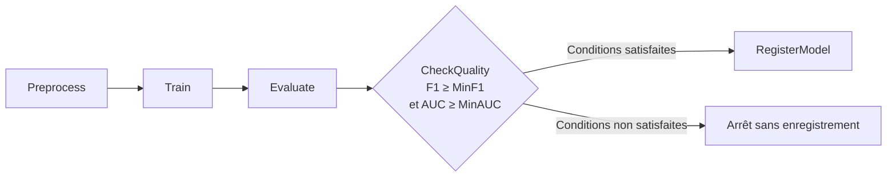

# Cybersecurity Threat Detection System on AWS

Détection automatique de comportements réseau suspects à l'aide de **XGBoost**, **Amazon SageMaker** et des services AWS.

Le système analyse les caractéristiques du trafic réseau et classe chaque événement comme **Normal (0)** ou **Suspect (1)**, avec une probabilité associée à la prédiction.

**Projet individuel réalisé selon la méthode Scrum**, organisé en 4 sprints de 2 semaines et suivi dans Jira avec la clé `CTDS`.

---

## Sommaire

* [Résultats](#résultats)
* [Architecture](#architecture)
* [Stack technique](#stack-technique)
* [Structure du dépôt](#structure-du-dépôt)
* [Prérequis](#prérequis)
* [Installation](#installation)
* [Utilisation](#utilisation)
* [Sécurité](#sécurité)
* [Coûts](#coûts)
* [Limites connues](#limites-connues)
* [Améliorations possibles](#améliorations-possibles)
* [Méthodologie](#méthodologie)
* [Licence des données](#licence-des-données)

## Résultats

Les métriques suivantes ont été obtenues sur le jeu de test officiel UNSW-NB15.

| Indicateur                  | Objectif |               Résultat |
| --------------------------- | -------: | ---------------------: |
| AUC                         |   ≥ 0,95 |              **0,984** |
| F1-score                    |   ≥ 0,90 |              **0,897** |
| Recall des attaques         |        — |                  0,984 |
| Precision                   |        — |                  0,824 |
| Latence d'inférence à chaud |    < 1 s |             145–176 ms |
| Latence du premier appel    |    < 1 s |              3,4–3,8 s |
| Coût total                  | < 50 USD | Voir `docs/results.md` |

Le modèle détecte environ **98,4 % des attaques** du jeu de test, mais génère également de fausses alertes sur une partie du trafic normal. Le F1-score reste inférieur de 0,003 à l'objectif fixé.

**Limite majeure :** la variable `sttl` domine l'importance des caractéristiques, avec une importance environ 26 fois supérieure à celle de la caractéristique suivante. Cela peut indiquer un artefact du jeu de données et soulève des questions sur la généralisation du modèle à des réseaux réels.

Les résultats détaillés, les seuils, les matrices de confusion et les coûts sont documentés dans [`docs/results.md`](docs/results.md).

## Architecture

### Flux de traitement et d'inférence



### Pipeline SageMaker

Le pipeline `ctds-pipeline` automatise le prétraitement, l'entraînement, l'évaluation et le contrôle qualité avant l'enregistrement du modèle.



Le contrôle qualité empêche l'enregistrement d'un modèle lorsque les seuils configurés ne sont pas atteints.

**Test de rejet documenté :** avec `MinF1 = 0,95`, les étapes `Preprocess`, `Train`, `Evaluate` et `CheckQuality` ont réussi, mais aucune étape `RegisterModel` n'a été exécutée. Le registre est resté à la version 2, sans création de version 3.

## Stack technique

| Catégorie                          | Technologies                    |
| ---------------------------------- | ------------------------------- |
| Cloud                              | AWS                             |
| Stockage                           | Amazon S3                       |
| Traitement serverless              | AWS Lambda                      |
| Machine learning                   | Amazon SageMaker, XGBoost 1.7-1 |
| Automatisation ML                  | SageMaker Pipelines             |
| Gestion des modèles                | SageMaker Model Registry        |
| Monitoring                         | Amazon CloudWatch               |
| Sécurité                           | AWS IAM, chiffrement SSE-S3     |
| Langage                            | Python 3.12                     |
| Données et tests                   | pandas, pytest                  |
| Versionnement et gestion de projet | Git, GitHub, Jira               |

**Région AWS :** `eu-north-1` — Europe (Stockholm).

## Structure du dépôt

```text
cybersecurity-threat-detection/
├── README.md
├── requirements.txt
├── data/
│   ├── raw/                     # Données brutes, non versionnées
│   └── processed/               # Données préparées, non versionnées
├── lambda/
│   ├── preprocessing.py         # Prétraitement des données
│   └── inference.py             # Inférence JSON → endpoint
├── ml/
│   ├── launch_training.py       # Entraînement XGBoost
│   ├── evaluate.py              # Évaluation du modèle
│   ├── analyze.py               # Analyse des métriques et features
│   ├── register_model.py        # Enregistrement du modèle
│   ├── deploy_endpoint.py       # Déploiement de l'endpoint
│   ├── delete_endpoint.py       # Suppression de l'endpoint
│   ├── make_defaults.py         # Calcul des valeurs par défaut
│   ├── test_endpoint.py         # Test direct de l'endpoint
│   └── e2e_test.py              # Tests via la Lambda d'inférence
├── sagemaker/
│   └── pipeline/
│       ├── preprocess.py        # Étape Preprocess
│       ├── evaluate_step.py     # Étape Evaluate
│       └── build_pipeline.py    # Définition du pipeline
├── notebooks/
│   └── eda.ipynb                # Analyse exploratoire
├── tests/                       # Tests unitaires
└── docs/
    ├── dataset.md               # Dataset et conditions d'utilisation
    ├── features.md              # Variables et découpage
    ├── iam.md                   # Rôles et permissions
    ├── results.md               # Résultats, limites et coûts
    └── cahier-des-charges.md    # Cahier des charges
```

## Prérequis

* Un compte AWS avec les autorisations nécessaires pour S3, Lambda et SageMaker.
* La région AWS `eu-north-1`.
* Des quotas SageMaker suffisants pour l'entraînement et l'hébergement de l'endpoint, notamment `ml.m5.large`.
* Python 3.12 et Git.
* AWS CloudShell ou un environnement local configuré avec des identifiants AWS temporaires ou un rôle autorisé.
* Le dataset UNSW-NB15 téléchargé depuis la [source officielle](https://research.unsw.edu.au/projects/unsw-nb15-dataset).

**Important :** le plan gratuit AWS ne garantit pas que tous les services SageMaker soient gratuits. Vérifiez les tarifs et les quotas avant de lancer des ressources.

Les conditions d'utilisation des données sont décrites dans [`docs/dataset.md`](docs/dataset.md).

## Installation

Cloner le dépôt et préparer l'environnement Python :

```bash
git clone https://github.com/khaoula-dr/cybersecurity-threat-detection.git
cd cybersecurity-threat-detection

python3 -m venv .venv
source .venv/bin/activate

python -m pip install --upgrade pip
pip install -r requirements.txt
pip install pytest

pytest tests/ -v
```

Les fichiers CSV du dataset et les données traitées ne sont pas versionnés dans Git. Placez les fichiers téléchargés dans `data/raw/` conformément aux noms attendus par les scripts.

Pour les opérations AWS, configurez les autorisations nécessaires. Dans CloudShell, utilisez les autorisations de la session AWS en cours, sans créer de clés d'accès supplémentaires.

## Utilisation

Les noms de bucket, les rôles IAM, les noms de ressources et les identifiants de compte doivent correspondre à votre environnement. Vérifiez la configuration de chaque script avant son exécution.

### 1. Préparer l'infrastructure S3

Créer un bucket S3 dans `eu-north-1` et configurer :

* Le blocage de tous les accès publics.
* Le chiffrement côté serveur SSE-S3.
* Le versioning du bucket.
* Les préfixes `raw/`, `processed/` et `models/`.

Charger les trois fichiers UNSW-NB15 dans `raw/` :

```text
raw/
├── UNSW_NB15_features.csv
├── UNSW_NB15_training-set.csv
└── UNSW_NB15_testing-set.csv
```

Vérifier le contenu :

```bash
aws s3 ls s3://VOTRE_BUCKET/raw/ --region eu-north-1
```

### 2. Configurer le prétraitement

Créer la fonction Lambda `ctds-preprocessing` avec le runtime Python 3.12, les paramètres mémoire et timeout adaptés, et le gestionnaire `preprocessing.handler`.

Configurer le déclencheur S3 avec le préfixe `raw/` et le suffixe `training-set.csv`, selon la configuration du projet.

La fonction prépare les données et écrit les fichiers nécessaires dans `processed/`. Vérifier les journaux dans CloudWatch après un déclenchement.

### 3. Entraîner et évaluer le modèle

Dans l'environnement contenant les scripts et les dépendances du projet :

```bash
python ml/launch_training.py
python ml/evaluate.py
python ml/register_model.py
```

Ces scripts permettent respectivement de lancer l'entraînement XGBoost, d'évaluer le modèle et d'enregistrer la version admissible dans SageMaker Model Registry.

Les dépendances doivent être compatibles avec le format du modèle produit par le conteneur XGBoost SageMaker 1.7-1. En particulier, une version locale de XGBoost incompatible peut empêcher le chargement du modèle lors de l'évaluation.

### 4. Exécuter le pipeline SageMaker

Installer une version compatible du SDK SageMaker si nécessaire :

```bash
pip install "sagemaker<3"
```

Puis exécuter :

```bash
export SAGEMAKER_SUPPRESS_V2_WARNING=1

python sagemaker/pipeline/build_pipeline.py
```

Pour tester le rejet d'un modèle lorsque `MinF1 = 0,95` :

```bash
python sagemaker/pipeline/build_pipeline.py 0.95
```

Le temps d'exécution et le coût dépendent des ressources et des étapes effectivement lancées.

Pour récupérer la dernière exécution du pipeline :

```bash
ARN=$(aws sagemaker list-pipeline-executions \
  --pipeline-name ctds-pipeline \
  --region eu-north-1 \
  --query "PipelineExecutionSummaries[0].PipelineExecutionArn" \
  --output text)

aws sagemaker describe-pipeline-execution \
  --pipeline-execution-arn "$ARN" \
  --region eu-north-1 \
  --query "PipelineExecutionStatus"

aws sagemaker list-pipeline-execution-steps \
  --pipeline-execution-arn "$ARN" \
  --region eu-north-1 \
  --query "PipelineExecutionSteps[].[StepName,StepStatus]"
```

Une exécution peut réussir tout en s'arrêtant volontairement avant `RegisterModel`, lorsque la condition de qualité n'est pas satisfaite.

### 5. Déployer et tester l'inférence

Créer la Lambda `ctds-inference` avec le gestionnaire `inference.handler`, puis configurer ses variables d'environnement `BUCKET` et `ENDPOINT`.

Générer les valeurs par défaut nécessaires à l'inférence :

```bash
python ml/make_defaults.py
```

**Attention : le déploiement de l'endpoint peut entraîner des coûts horaires.** Ne lancez cette étape que lorsque vous êtes prêt à effectuer les tests.

```bash
python ml/deploy_endpoint.py
```

Exécuter les tests de bout en bout :

```bash
python ml/e2e_test.py
```

Le script vérifie trois cas : une attaque, un trafic normal et un cas limite connu du modèle. Chaque cas est appelé deux fois pour comparer les résultats et les latences.

Exemple d'entrée pour la Lambda :

```json
{
  "proto": "tcp",
  "service": "http",
  "state": "FIN",
  "sttl": 62.0,
  "dur": 1.687215,
  "spkts": 10.0,
  "dpkts": 10.0,
  "sbytes": 848.0,
  "dbytes": 1262.0,
  "rate": 11.261161
}
```

Exemple de réponse :

```json
{
  "prediction": "Normal",
  "probability": 0.2347
}
```

Les valeurs de la réponse sont illustratives : elles dépendent du modèle déployé et de l'entrée. Les champs absents sont remplacés par les valeurs par défaut définies par le projet.

### 6. Supprimer l'endpoint après les tests

Dès que les tests sont terminés, supprimer l'endpoint :

```bash
python ml/delete_endpoint.py
```

Vérifier les endpoints encore présents :

```bash
aws sagemaker list-endpoints \
  --region eu-north-1 \
  --query "Endpoints[].[EndpointName,EndpointStatus]" \
  --output table
```

Vérifier que l'endpoint créé pour les tests a bien disparu. La suppression de l'endpoint ne supprime pas nécessairement les configurations, les modèles ou les artefacts S3 associés.

## Sécurité

* Bucket S3 privé, accès public bloqué, chiffrement SSE-S3 et versioning activé.
* Permissions IAM limitées aux ressources et actions nécessaires.
* Aucun secret, fichier `.env`, identifiant ou dataset brut ne doit être ajouté au dépôt Git.
* Utilisation des rôles IAM et des autorisations de la session AWS plutôt que de clés codées en dur.
* Surveillance des exécutions Lambda et SageMaker dans CloudWatch.

Consulter [`docs/iam.md`](docs/iam.md) pour les rôles et permissions du projet.

## Coûts

Les montants ci-dessous sont des estimations issues de l'environnement du projet et non des tarifs garantis.

| Ressource                        |                                              Estimation |
| -------------------------------- | ------------------------------------------------------: |
| Job d'entraînement               | Environ 0,003 USD par job, selon la durée et l'instance |
| Endpoint SageMaker `ml.m5.large` | Environ 0,12 USD par heure selon l'estimation du projet |
| Lambda, S3 et Model Registry     |                 Dépend de l'utilisation et de la région |
| Coût total du projet             |               Voir [`docs/results.md`](docs/results.md) |

**Bonne pratique :** supprimer les endpoints dès que les tests sont terminés et vérifier les ressources encore actives dans AWS Billing et SageMaker.

## Limites connues

* `sttl` domine l'importance du modèle ; sa contribution doit être étudiée avant toute utilisation réelle.
* Les distributions du jeu d'entraînement et du jeu de test diffèrent.
* Les attaques sont majoritaires dans le dataset, contrairement à de nombreux environnements réels.
* Le F1-score de 0,897 est légèrement inférieur à l'objectif de 0,90.
* Une partie importante des attaques manquées appartient à la catégorie `Fuzzers`.
* Les caractéristiques `ct_*` absentes sont remplacées par des valeurs par défaut à l'inférence.
* Le premier appel est plus lent que les appels suivants, notamment en raison du démarrage à froid.
* Le déclencheur S3 repose sur les noms et les préfixes de fichiers prévus pour ce dataset.
* Le seuil `MinF1 = 0,89` a été configuré après observation des résultats ; une validation indépendante serait nécessaire pour une évaluation plus rigoureuse.

Ce projet constitue un prototype académique et ne doit pas être considéré comme un système de détection prêt pour la production sans validation supplémentaire.

## Améliorations possibles

Les évolutions suivantes sont envisagées :

* Réaliser une étude d'ablation de `sttl`.
* Ajouter des alertes via Amazon SNS.
* Créer un tableau de bord et des alarmes CloudWatch.
* Mettre en place SageMaker Model Monitor.
* Automatiser l'infrastructure avec Terraform ou AWS CloudFormation.
* Renforcer l'audit et la sécurité avec AWS CloudTrail et AWS KMS.
* Réduire la latence du premier appel et améliorer la gestion des erreurs.

## Méthodologie

Projet individuel organisé selon **Scrum**, avec quatre sprints de deux semaines, un backlog Jira et des user stories suivies sous la clé `CTDS`.

Le travail couvre la préparation des données, l'infrastructure AWS, l'entraînement et l'évaluation du modèle, l'automatisation du pipeline, le déploiement de l'inférence et les tests.

Le cahier des charges est disponible dans [`docs/cahier-des-charges.md`](docs/cahier-des-charges.md).

## Licence des données

Le projet utilise le dataset **UNSW-NB15**. La source officielle, les informations de licence et les conditions d'utilisation sont décrites dans [`docs/dataset.md`](docs/dataset.md) et sur le [site officiel du dataset UNSW-NB15](https://research.unsw.edu.au/projects/unsw-nb15-dataset).
